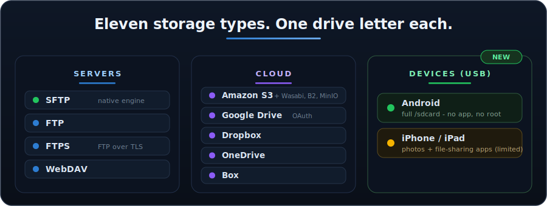
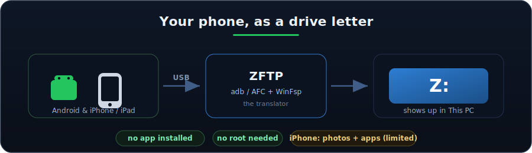
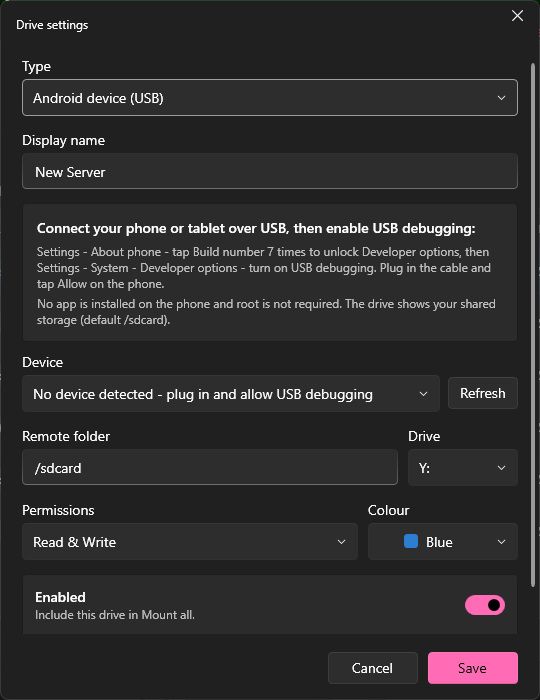
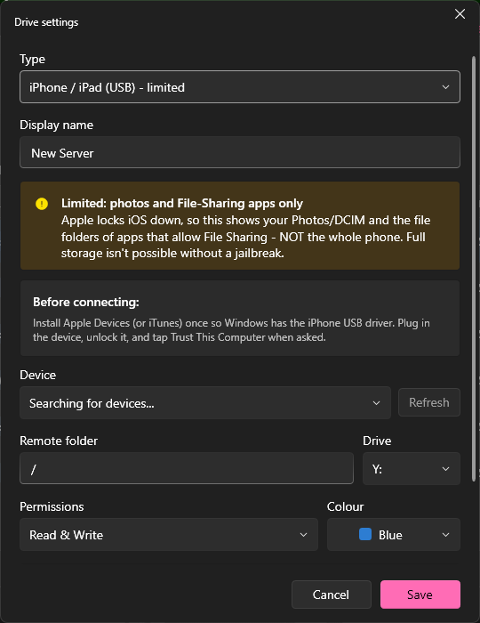
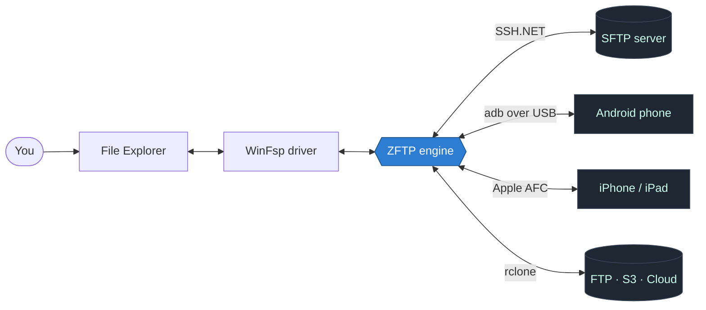
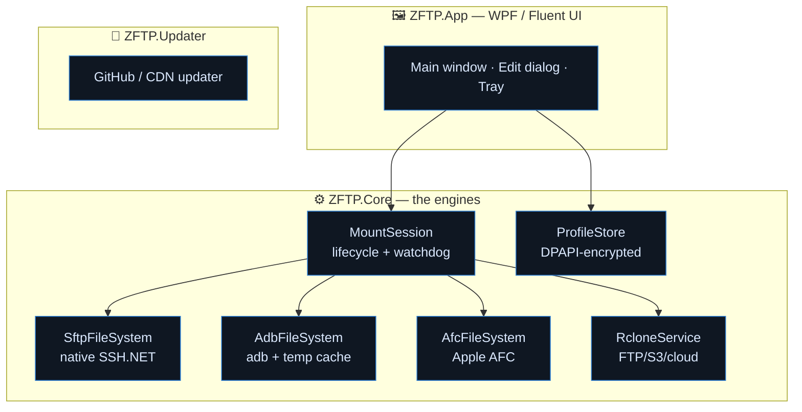
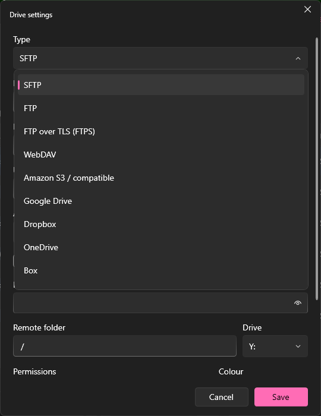

<!-- ============================================================ -->
<!--                          ZFTP                                -->
<!-- ============================================================ -->

<div align="center">


# ZFTP

### Mount anything as a Windows drive. SFTP, cloud, your phone. Free, open, and gorgeous.

<br/>

[](https://github.com/BallisticOK/ZFTP/releases)
[](https://github.com/BallisticOK/ZFTP/releases)
[](https://dotnet.microsoft.com/)
[](#-why-it-exists)

<br/>

**11 storage types. One drive letter each. Zero subscriptions.**

[Download](#-install) &nbsp;•&nbsp; [Features](#-features) &nbsp;•&nbsp; [How it works](#-how-it-works) &nbsp;•&nbsp; [Providers](#-supported-storage) &nbsp;•&nbsp; [Build](#-build-from-source)

<br/>


</div>

---

## ✨ What is this

ZFTP turns remote storage into a **regular drive letter** on your PC. Set it up once, hit Mount, and it shows up in **This PC** like any other disk. Open it in File Explorer, drag files in and out, edit documents straight off it, point any program at it. No FTP client, no "download, edit, re-upload" dance, no browser tab to some cloud UI.

It started as an SFTP tool. It now mounts **eleven kinds of storage** through one clean app:

<div align="center">

| 🗄️ Servers | ☁️ Cloud | 📱 Devices |
|:---:|:---:|:---:|
| SFTP · FTP · FTPS · WebDAV | S3 · Google Drive · Dropbox · OneDrive · Box | Android (USB) · iPhone / iPad (USB) |

</div>

---

## 🚀 Features

<table>
<tr>
<td width="50%" valign="top">

#### Drives that feel native
- **Real drive letters** under *This PC*, not a clunky sync folder
- **Your server's name becomes the drive label** — "Home NAS" shows as *Home NAS (Z:)*
- **Custom per-drive colour & icon** in Explorer
- **Multiple drives at once**, each on its own letter
- **Live transfer speed** with up/down rates and session totals

</td>
<td width="50%" valign="top">

#### Set it and forget it
- **Auto-mount on startup** + **Start with Windows**
- **Self-healing** — a watchdog silently remounts after sleep, Wi-Fi drops, or a phone reconnect
- **System tray** — closing the window keeps drives mounted
- **Built-in updater** from GitHub Releases / CDN
- **10 themes**, dark and light, with accent colours

</td>
</tr>
<tr>
<td width="50%" valign="top">

#### Security first
- **Passwords encrypted with Windows DPAPI**, tied to your account — never plain text on disk
- **SSH host-key pinning** — trust-on-first-use, refuses silent key changes (anti-MITM)
- **Password or SSH key** auth
- **Per-drive Read-only mode**

</td>
<td width="50%" valign="top">

#### Honest about limits
- **Cloud sign-in via your browser** — ZFTP never sees your password
- **Phones need no app installed** and **no root / jailbreak**
- **adb is killed when idle** so updates never get blocked
- Everything that's limited (hello iPhone) is **labelled as limited**

</td>
</tr>
</table>

---

## 🔌 Supported storage

<div align="center">



<br/><br/>

| Provider | Engine | Auth | Notes |
|---|:---:|---|---|
| **SFTP** | 🟢 Native (SSH.NET) | Password / SSH key | Full read/write, host-key pinning, real drive size via `df` |
| **FTP** | 🔵 rclone | Password | Plain FTP |
| **FTPS** | 🔵 rclone | Password | FTP over TLS |
| **WebDAV** | 🔵 rclone | Password | Nextcloud, ownCloud, generic DAV |
| **Amazon S3** | 🔵 rclone | Access key / secret | + S3-compatible: Wasabi, B2, DO Spaces, MinIO… |
| **Google Drive** | 🔵 rclone | 🌐 Browser OAuth | Change-notify polling for instant freshness |
| **Dropbox** | 🔵 rclone | 🌐 Browser OAuth | |
| **OneDrive** | 🔵 rclone | 🌐 Browser OAuth | |
| **Box** | 🔵 rclone | 🌐 Browser OAuth | |
| **Android** | 🟢 Native (adb) | USB debugging | No app, no root. Browses full `/sdcard` shared storage |
| **iPhone / iPad** | 🟡 Native (AFC) | USB + Trust | **Limited:** photos + File-Sharing apps only (iOS is locked down) |

🟢 in-process native engine &nbsp;·&nbsp; 🔵 bundled rclone &nbsp;·&nbsp; 🟡 limited by the platform

</div>

> [!NOTE]
> **iPhone is deliberately limited.** Apple has no `adb` equivalent and sandboxes everything, so AFC only exposes your **Photos/DCIM and the Documents of apps that enable File Sharing** — not the whole phone. Full-device access isn't possible without a jailbreak. It also needs **Apple Devices / iTunes** installed for the USB driver. Android, by contrast, gives you the whole shared storage.

### 📱 New in 2.5 / 2.6 — mount your phone over USB

<div align="center">



</div>

Plug a phone in, and ZFTP makes it a drive. **Android** uses Google's `adb` (turn on USB debugging) and gives you the whole `/sdcard` — no app on the phone, no root. **iPhone/iPad** uses Apple's AFC channel for photos and File-Sharing apps. ZFTP even **shuts the `adb` server down when no Android drive is mounted**, so it never lingers in the background or blocks an update.

<div align="center">

<table>
<tr>
<td align="center" width="50%">
<br/>
<b>Android — full shared storage</b><br/>
<sub>Built-in setup guide, device picker, mounts <code>/sdcard</code></sub>
</td>
<td align="center" width="50%">
<br/>
<b>iPhone / iPad — honestly limited</b><br/>
<sub>A bright warning bar spells out exactly what AFC can and can't reach</sub>
</td>
</tr>
</table>

</div>

---

## 🧠 How it works

Every file action you take on the drive becomes a real operation against the remote. ZFTP is the translator in the middle.



When Explorer asks to list a folder or save a file, **WinFsp** (a user-mode filesystem driver) hands that request to ZFTP. ZFTP turns it into the matching protocol call — an SFTP request, an `adb pull`, an AFC read, an rclone op — and hands the answer back. The result: remote bytes appear as a local disk.

<details>
<summary><b>📐 Architecture — three projects, four engines</b></summary>

<br/>



| Project | Role |
|---|---|
| `ZFTP.Core` | The engines — four filesystem implementations, connection profiles, encrypted storage, the updater logic |
| `ZFTP.App` | The WPF window you actually look at |
| `ZFTP.Updater` | A small standalone updater that pulls new versions from GitHub Releases or a CDN |

**Why two engine styles?** SFTP, Android, and iPhone get hand-written WinFsp filesystems for tight control (host-key pinning, `/sdcard` shell tricks, AFC random access). Everything else — FTP, S3, the OAuth clouds — rides on the battle-tested **rclone**, bundled right in. One app, the best tool for each job.

</details>

<details>
<summary><b>🔍 Engine details — the clever bits</b></summary>

<br/>

- **SFTP** is fully native via SSH.NET, with a short-lived attribute cache so browsing a folder doesn't re-stat every file over the wire, plus a background `df` probe so Explorer shows the drive's *real* size.
- **Android** talks over `adb`. Since adb only does whole-file `pull`/`push` (no random access), it uses a **download-on-open / upload-on-close temp cache** — open a big video, brief copy, then it's instant. adb's background server is **killed when no Android drive is mounted** so it never blocks an update.
- **iPhone** uses Apple's AFC channel, which *does* give real seek/read/write handles — so it reads and writes **directly**, no temp cache.
- **Cloud drives** use rclone's VFS cache (`--vfs-cache-mode full`) and background tree-walk (`--vfs-refresh`) so folders open instantly instead of stalling on a slow API call.

</details>

---

## 📸 Showcase

<div align="center">

<table>
<tr>
<td align="center" width="50%">
<br/>
<b>Mission control</b><br/>
<sub>Every drive, its status, live speed, all in one window</sub>
</td>
<td align="center" width="50%">
<br/>
<b>One form, any provider</b><br/>
<sub>The fields morph to whatever storage type you pick</sub>
</td>
</tr>
<tr>
<td align="center" width="50%">
<br/>
<b>Settings that respect you</b><br/>
<sub>Startup, mounting, theme, and one-click updates</sub>
</td>
<td align="center" width="50%">
<br/>
<b>Pick any provider</b><br/>
<sub>One dropdown, every storage type — the form adapts to your choice</sub>
</td>
</tr>
</table>

</div>

---

## 📦 Install

<div align="center">

### [⬇️ Download the latest installer](https://github.com/BallisticOK/ZFTP/releases)

</div>

1. Grab `ZFTP-Setup-x.y.z.exe` from the [**Releases**](https://github.com/BallisticOK/ZFTP/releases) page.
2. Run it. Windows SmartScreen may warn you — the installer isn't code-signed (certificates cost money; this is free). Click **More info → Run anyway**, or [build it yourself](#-build-from-source).
3. The installer silently sets up **WinFsp** and the **.NET 8 runtime** only if they're missing, makes shortcuts, and cleans up after itself.

Then open ZFTP → **New** → fill in your storage → **Connect**. Done.

> [!TIP]
> For **iPhone/iPad** drives, install **Apple Devices** (or iTunes) once so Windows has the USB driver, then unlock the phone and tap **Trust This Computer**.

---

## 🛠️ Build from source

You'll need the [.NET 8 SDK](https://dotnet.microsoft.com/download/dotnet/8.0) and [WinFsp](https://winfsp.dev/).

```bash
git clone https://github.com/BallisticOK/ZFTP.git
cd ZFTP
dotnet build ZFTP.sln -c Release
```

Run it directly:

```bash
dotnet run --project src/ZFTP.App
```

<details>
<summary><b>Packaging the installer</b></summary>

<br/>

The bundled engines (`rclone.exe`, `adb.exe` + USB DLLs) ship in `src/ZFTP.App/tools/`; the Apple libraries come from the `imobiledevice-net` NuGet package automatically.

```bash
# 1) publish the app (framework-dependent, win-x64)
dotnet publish src/ZFTP.App/ZFTP.App.csproj -c Release -r win-x64 --self-contained false -o <pub>

# 2) publish the updater into the SAME folder
dotnet publish src/ZFTP.Updater/ZFTP.Updater.csproj -c Release -r win-x64 --self-contained false -o <pub>

# 3) compile the installer (Inno Setup)
ISCC.exe installer/ZFTP.iss
```

Output lands in `dist/ZFTP-Setup-<version>.exe`.

</details>

---

## ⚠️ A word about permissions

This trips people up, so plainly: **ZFTP can only do what the remote lets your account do.**

For **SFTP**, you act as your real Linux user — no `sudo`. If a folder is owned by `root` and your user only has read access, you can browse it but not write. That "access denied" is the *server* talking, not ZFTP. The fix is server-side:

```bash
sudo chown -R youruser:youruser /path/to/folder
# or grant access without changing ownership:
sudo setfacl -R -m  u:youruser:rwx /path/to/folder
sudo setfacl -R -d -m u:youruser:rwx /path/to/folder
```

For **phones**, you're limited by the platform: Android exposes shared storage (`/sdcard`); iPhone exposes only photos + File-Sharing apps. ZFTP always defaults the *Windows* side to full read/write, so it's never the thing in your way.

---

## 💡 Why it exists

There's a well-known paid app that mounts SFTP as a drive. It works — but the free tier is crippled and the good stuff sits behind a subscription. Paying monthly to mount a server I already own felt silly, so I built my own. Then I kept going: cloud drives, then Android, then iPhone.

The goal never changed: **do everything the paid apps do, look better doing it, and charge no one.** The source is right here — don't trust random binaries, build it yourself (that instinct is healthy).

<div align="center">

| | ZFTP | Typical paid "net drive" app |
|---|:---:|:---:|
| Price | **Free, forever** | Subscription |
| Source available | ✅ | ❌ |
| SFTP | ✅ | ✅ |
| FTP / FTPS / WebDAV / S3 | ✅ | 💰 tiers |
| Google Drive / Dropbox / OneDrive / Box | ✅ | 💰 tiers |
| Android over USB | ✅ | ❌ |
| iPhone over USB | ✅ (limited) | ❌ |
| Encrypted credential storage | ✅ DPAPI | varies |

</div>

---

## 🗺️ Roadmap

- [x] Native SFTP engine with host-key pinning
- [x] FTP / FTPS / WebDAV / S3 via rclone
- [x] Google Drive / Dropbox / OneDrive / Box (browser OAuth)
- [x] Android over USB (adb)
- [x] iPhone / iPad over USB (AFC, limited)
- [x] Self-healing watchdog + auto-mount + tray
- [x] Built-in updater
- [ ] Live transfer speed for rclone-backed drives (via rclone `--rc`)
- [ ] Drag-and-drop drive reordering
- [ ] Per-drive bandwidth limits

---

## 🧰 Built with

[.NET 8](https://dotnet.microsoft.com/) + WPF &nbsp;·&nbsp; [WinFsp](https://winfsp.dev/) &nbsp;·&nbsp; [SSH.NET](https://github.com/sshnet/SSH.NET) &nbsp;·&nbsp; [rclone](https://rclone.org/) &nbsp;·&nbsp; [adb](https://developer.android.com/tools/adb) &nbsp;·&nbsp; [imobiledevice-net](https://github.com/libimobiledevice-win32/imobiledevice-net) &nbsp;·&nbsp; [WPF-UI](https://github.com/lepoco/wpfui) &nbsp;·&nbsp; [Inno Setup](https://jrsoftware.org/isinfo.php)

Huge thanks to those projects — ZFTP is mostly the glue and the face on top of their hard work.

---

## 📄 License

Do what you want with it. If you ship something based on it, a link back is appreciated but not required.

<div align="center">
<br/>
<sub>Made because paying a subscription to mount my own server felt silly.</sub>
<br/><br/>

⭐ **If ZFTP saved you a subscription, drop a star.**

</div>
