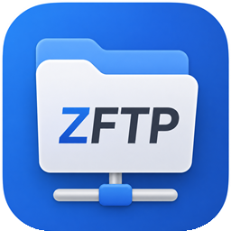
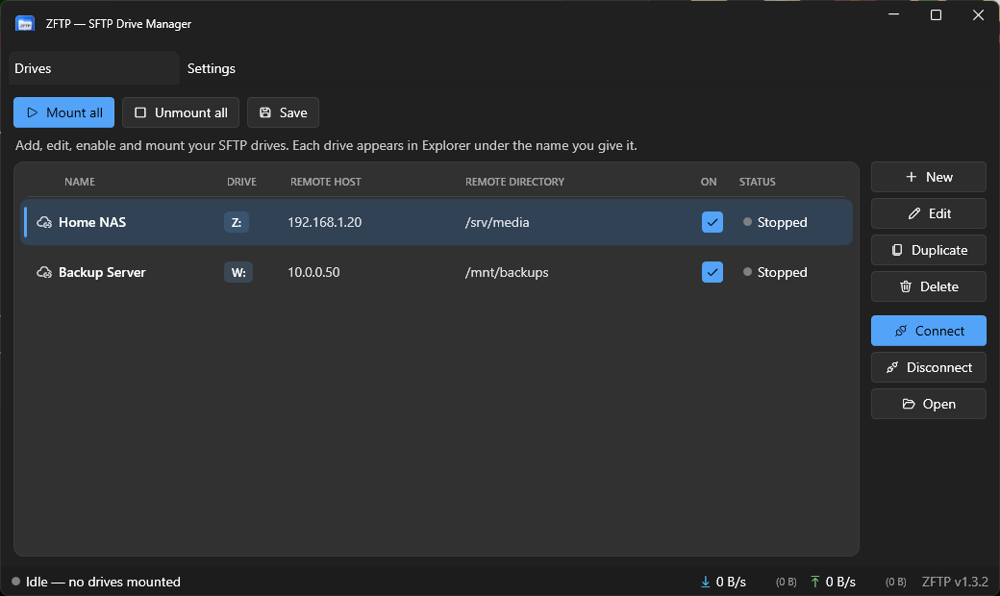
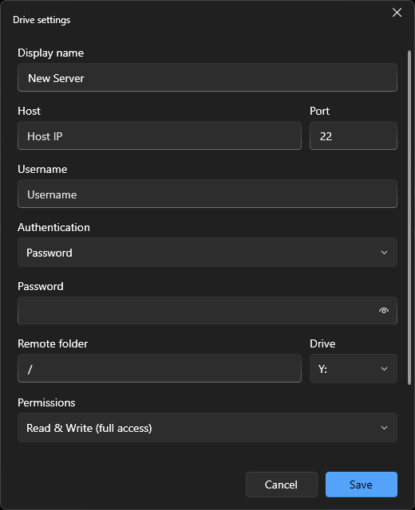
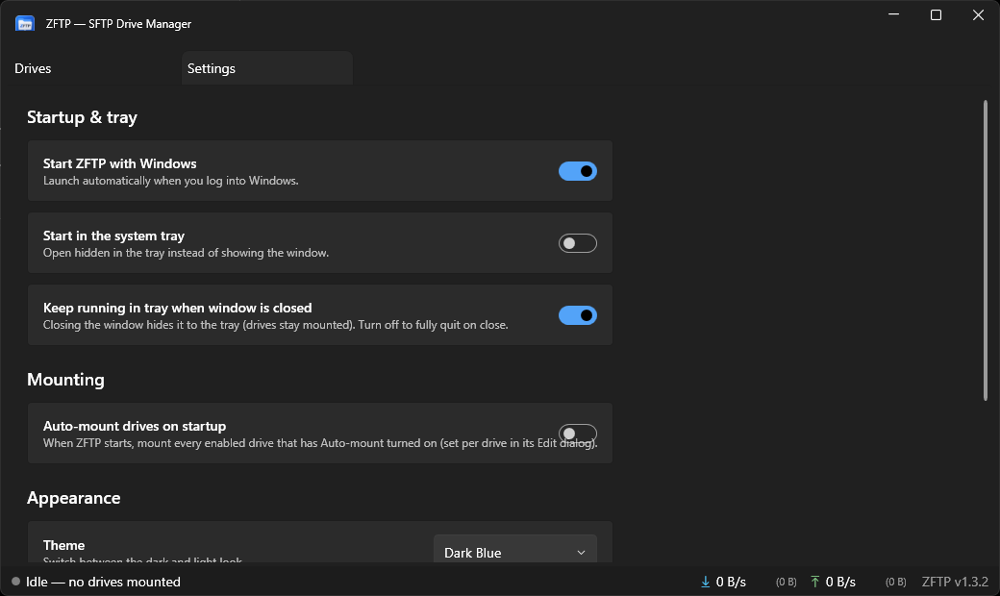

<div align="center">



# ZFTP

**Mount any SFTP server as a Windows drive. Free, open, and it actually looks nice.**


</div>

---

## What it is

ZFTP turns a remote SFTP server into a regular drive letter on your PC. You set it up once, hit Mount, and your server shows up in **This PC** like any other drive. Open it in File Explorer, drag files in and out, open documents straight off it, point a program at it. No separate FTP client, no "download, edit, re-upload" dance.

It mounts as a **network drive**, so it sits under *Network locations* in This PC exactly like a mapped network share would.



## Why I made it

There's a well-known app called SFTP Net Drive that does this. It works fine, but the free version is limited and the good stuff is behind a paywall. I didn't want to pay a subscription to mount a drive I already own the server for, so I built my own.

The goal was simple: do everything the paid app does, look better doing it, and don't charge anyone for it. ZFTP is the result. It's free, the source is right here, and you can build it yourself if you don't trust my binaries (you shouldn't trust random binaries, that's healthy).

## How it works

Two pieces do the heavy lifting, and both are free and battle-tested:

- **[WinFsp](https://winfsp.dev/)** is the part that lets a normal program pretend to be a disk. Windows has no built-in way for an app to "be a drive," so WinFsp provides a small driver that does. It's the same engine sshfs-win, rclone, and a bunch of other tools use. ZFTP ships it in the installer and sets it up for you.
- **[SSH.NET](https://github.com/sshnet/SSH.NET)** is the SFTP client. When Windows asks ZFTP to read a folder or save a file, ZFTP translates that into the matching SFTP request and sends it to your server.

So the flow is: **File Explorer → WinFsp → ZFTP → SSH.NET → your server**, and back again. Every file operation you do on the drive becomes a real SFTP operation under the hood. ZFTP itself is the translator in the middle, plus the app you actually look at.

The app is split into three parts in case you want to poke around the code:

| Project | What it does |
|---|---|
| `ZFTP.Core` | The engine — the SFTP-to-drive filesystem, connection profiles, settings, the updater |
| `ZFTP.App`  | The WPF window you interact with |
| `ZFTP.Updater` | A small separate updater that can pull new versions from GitHub or a CDN |

## Features

- **Mount SFTP servers as drive letters** that show up under Network locations
- **Whatever name you give a server is its drive label** in Explorer (so "Home NAS" shows up as *Home NAS (Z:)*, not some random volume name)
- **Multiple drives at once**, each on its own letter, all managed from one window
- **Saved servers** — your list is stored in `%AppData%\ZFTP` and remembered between launches
- **Passwords are encrypted** on disk with Windows DPAPI, tied to your account. They're never sitting there in plain text
- **Password or SSH key** authentication
- **Per-drive permissions** — set a drive to full Read & Write or to Read-only
- **Auto-mount on startup** and **start with Windows**, so your drives are ready the second you log in
- **System tray** — closing the window tucks it away and keeps your drives mounted
- **10 themes** (dark and light, with different accent colours)
- **Live transfer speed** with up/down rates and a running session total
- **Built-in updater** that checks GitHub Releases and/or a CDN and installs new versions for you
- **A real installer** that handles WinFsp and the .NET runtime, makes shortcuts, and uninstalls cleanly

## Screenshots

**Adding a server** — everything you need on one form, nothing you don't:



**Settings** — startup behaviour, mounting, theme, and updates:



## Installing

1. Grab the latest `ZFTP-Setup-x.y.z.exe` from the [Releases](https://github.com/BallisticOK/ZFTP/releases) page.
2. Run it. Windows might show a SmartScreen warning because the installer isn't code-signed (signing certificates cost money and this is a free project). Click **More info → Run anyway** if you're comfortable — or build it yourself from source.
3. The installer drops in WinFsp and the .NET runtime if you don't already have them, makes Start Menu and Desktop shortcuts, and that's it.

Then open ZFTP, click **New**, fill in your server, and hit **Connect**.

## Using it

1. **New** opens the form above. Give the drive a name, your host/IP, username, and a password or key.
2. Pick a drive letter and whether it's read/write or read-only.
3. **Save**, then **Connect**. Your drive pops up in This PC.
4. Want it mounted automatically? Turn on **Auto-mount** in the drive's Edit dialog and **Auto-mount drives on startup** in Settings. Pair that with **Start with Windows** and your drives are just always there.

## A heads-up about permissions

This trips people up, so it's worth saying plainly: **ZFTP can only do what your SSH user is allowed to do.**

If you connect as a user that doesn't have write access to a folder on the server, you'll get "access denied" when you try to save there — and that's the server saying no, not ZFTP. SFTP runs as your actual Linux user; it does **not** use `sudo`. So if a folder is owned by `root` and your user only has read access, you can browse it but not write to it.

The fix is on the server side. For example, to give a user full access to a folder:

```bash
sudo chown -R youruser:youruser /path/to/folder
# or, to add access without changing ownership:
sudo setfacl -R -m  u:youruser:rwx /path/to/folder
sudo setfacl -R -d -m u:youruser:rwx /path/to/folder
```

ZFTP defaults every mount to full read/write on the Windows side, so it's never the thing standing in your way — the server's file permissions are.

## Building from source

You'll need the [.NET 8 SDK](https://dotnet.microsoft.com/download/dotnet/8.0) and [WinFsp](https://winfsp.dev/) installed.

```bash
git clone https://github.com/BallisticOK/ZFTP.git
cd ZFTP
dotnet build ZFTP.sln -c Release
```

To run the app directly:

```bash
dotnet run --project src/ZFTP.App
```

The installer is built with [Inno Setup](https://jrsoftware.org/isinfo.php) from `installer/ZFTP.iss`.

## Updating

ZFTP can update itself. **Settings → Check for updates** (or the *Check for ZFTP Updates* shortcut) looks at this repo's Releases and grabs anything newer, then runs the installer. Your saved servers and settings stay put through an update.

## Built with

- [.NET 8](https://dotnet.microsoft.com/) and WPF
- [WinFsp](https://winfsp.dev/) — the user-mode filesystem driver
- [SSH.NET](https://github.com/sshnet/SSH.NET) — SFTP client
- [WPF-UI](https://github.com/lepoco/wpfui) — the Fluent/Windows 11 look
- [Inno Setup](https://jrsoftware.org/isinfo.php) — the installer

Big thanks to those projects — ZFTP is mostly the glue and the face on top of their hard work.

## License

Do what you want with it. If you ship something based on it, a link back is appreciated but not required.

---

<div align="center">
Made because paying a subscription to mount my own server felt silly.
</div>
